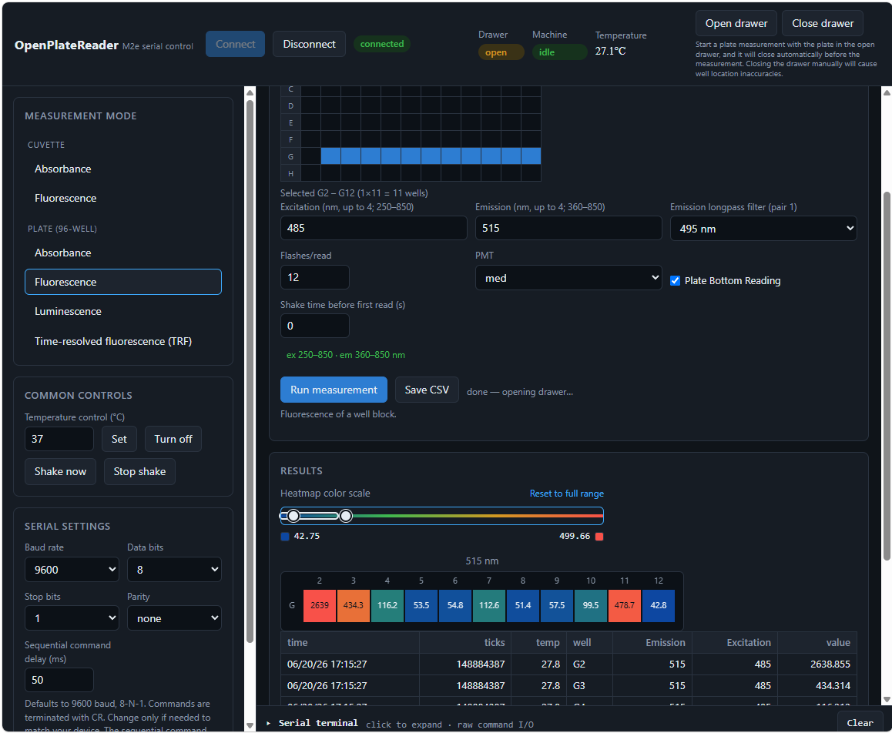
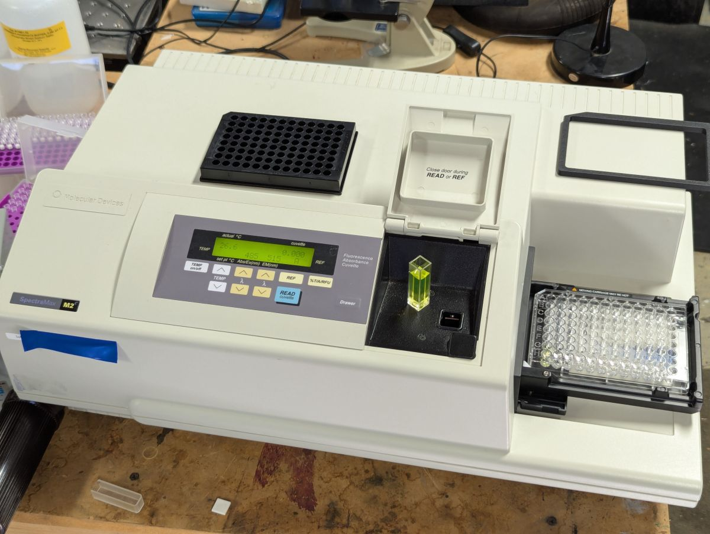
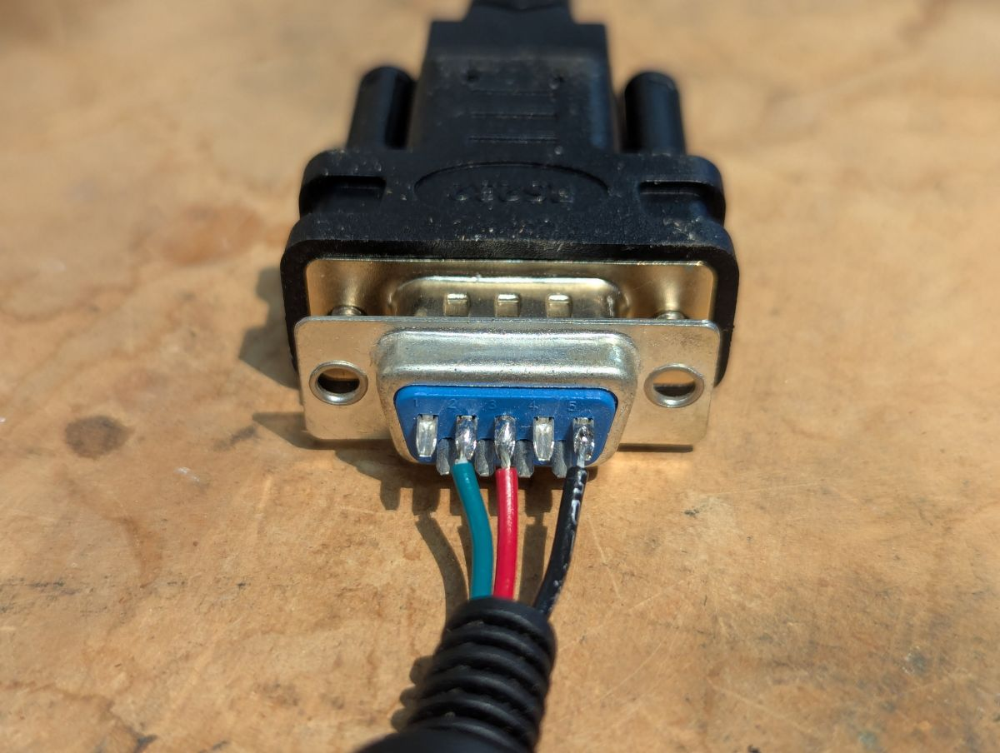
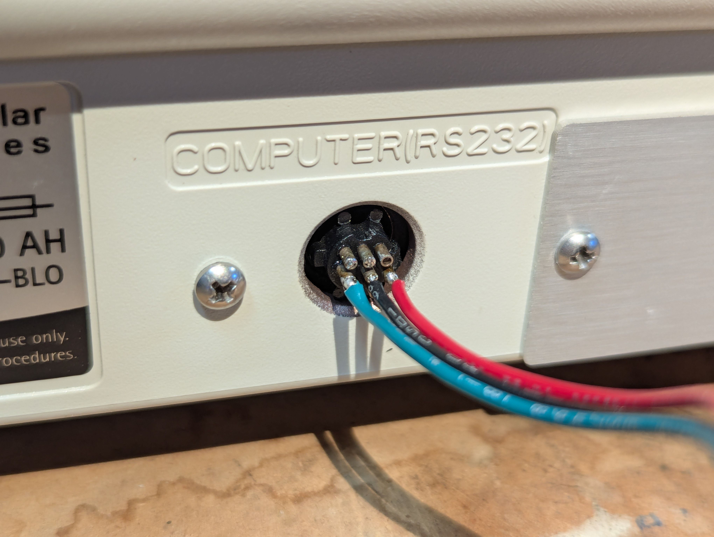
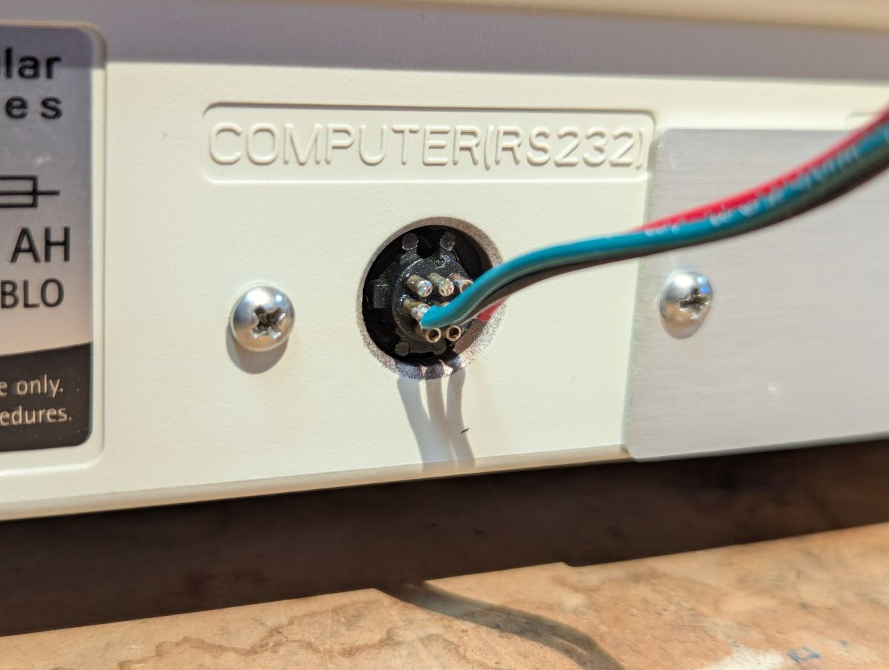
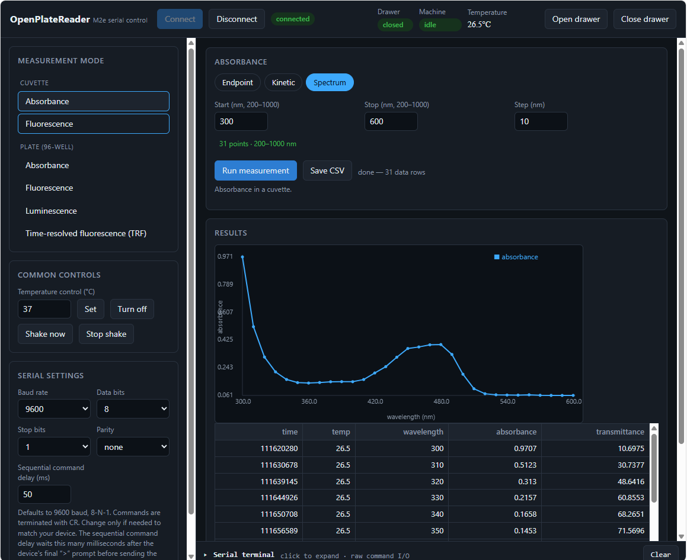
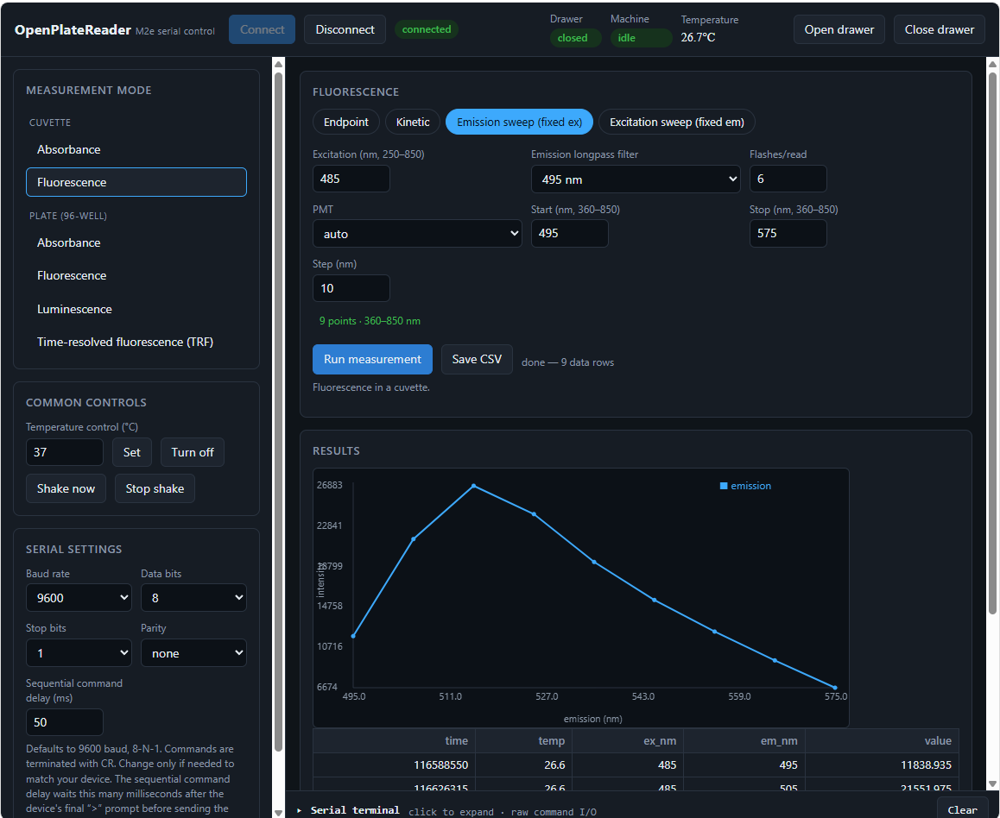
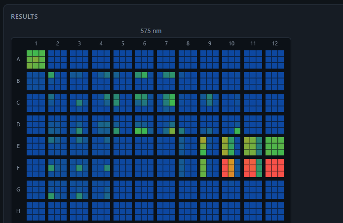
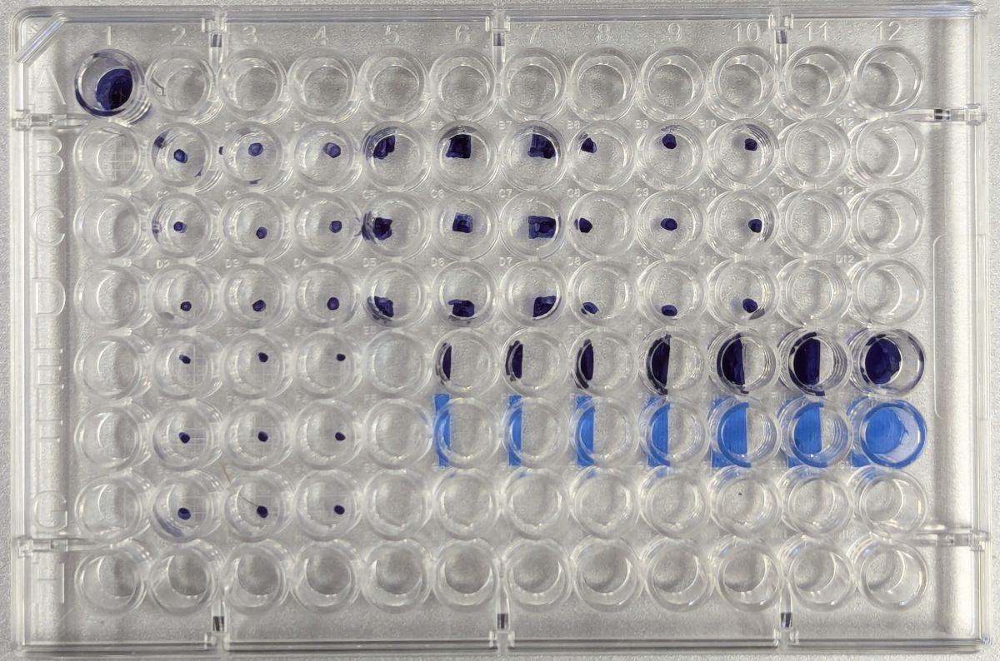
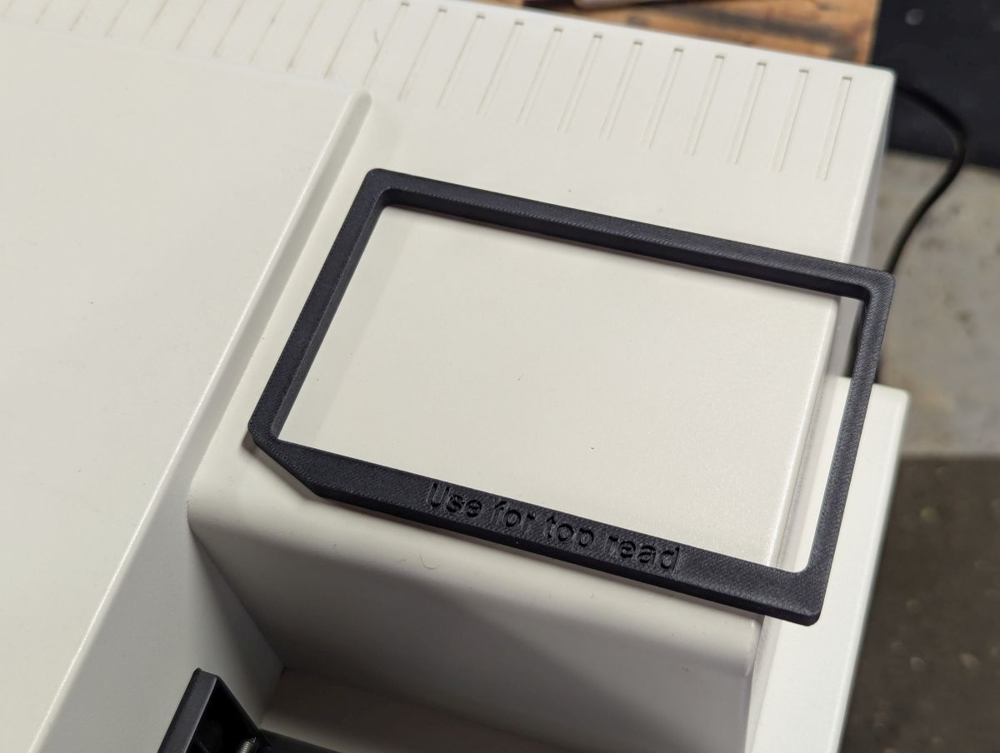

# OpenPlateReader
Open source single-page web app to read data from laboratory plate readers.  Currently, it supports the Molecular Devices SpectraMax M2e.  I created a list of serial commands and example data transactions for the M2e, which are shown in the M2e_commands.xlsx file.  This was my first coding project using Claude Code.  I created the spreadsheet of commands by hand, and had Claude read it and create the application after I described it.  Some modes worked on the first shot.  I spent a couple partial days instructing Claude to add features and debugging with the hardware.  I didn't write any of the code directly.

This app works only in chromium based browsers (Chrome, Edge, Opera, etc) since it uses the Web Serial API. It will not work in Firefox or Safari (as of June 2026).

Installation is simple: just open the .html file in a browser.  Press the "connect" button, and a list of available COM ports should appear.

I'm using a USB to Serial adapter cable.  The wiring to connect this to the SpectraMax M2e is shown here:

I also modeled and 3D-printed the "top read" adapter to raise the position of 96 and 384 well plate by 6mm.  CAUTION:  I do not have an original adapter, and modeled this based on photos that I have seen.  I've used this on my machine without any issue, but be warned that the dimensions of this part may not be correct.  Please contact me if you have an original adapter and can make some measurements.

